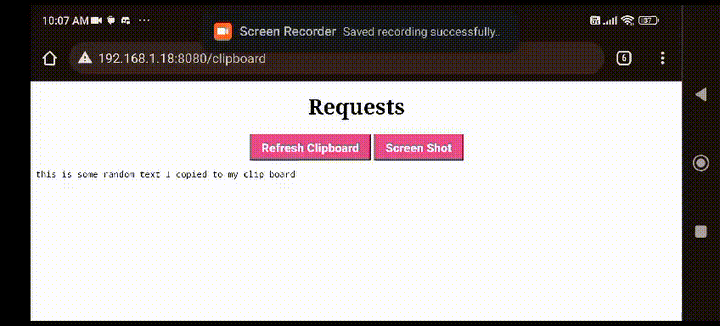

# Clipboard HTTP Server

This C++ project implements a simple HTTP server using socket programming. The server is designed to handle two types of requests

1) **Clipboard Request**: Allows clients to retrieve the latest copied text from the host's clipboard.
2) **Screenshot Request**: Enables clients to request the server to capture a screenshot from the host.

## Demo
This is a demo of me accessing my pc clipboard remotly from my phone 
<div style="width:50%; text-align:center;">
    
</div>

## Prerequisites

- C++ compiler
- Linux based OS
- **Dependencies**:
    1. CMake 
    ```bash
    sudo apt-get install cmake
    ```
    2. scrot (for Screenshots)
    ```bash
    sudo apt-get install scrot
    ```
    3. xclip (for Clipboard)
    ```bash
    sudo apt-get install xclip
    ```

## Build and Run

```bash
# Clone the repository
git clone https://github.com/AladdinT/clipboard-server.git
# Navigate to the build/ directory
cd /path/to/clipboard-server/build
# Build the project
make
# Run Server
./clipboard_server
```

Now your server is up and running http://localhost:8080/

